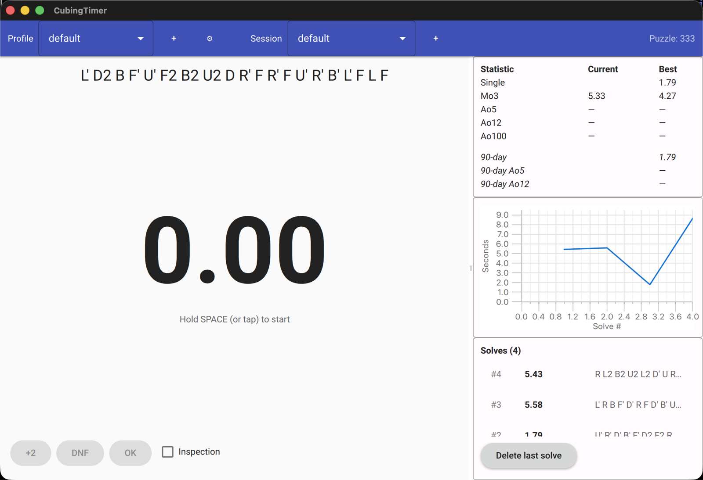

# CubingTimer

A small Qt6/QML speedcubing timer. It tries to do the things [csTimer](https://cstimer.net)
does that I actually use — time my solves, give me a scramble, remember my
history, and tell me my PB — without ads or a browser tab.



## Status

Early. Works on desktop (Linux/macOS/Windows). WebAssembly and Android builds
are wired up in CI but not extensively tested on real devices yet. Storage is
SQLite on desktop and Android, in-memory + CSV/JSON export on WASM.

There is no cloud sync, no smart-cube support, no algorithm trainer. There may
never be — the goal is "small and focused", not "feature parity with csTimer".

## What it does

- WCA-style hold-spacebar-to-arm timer (configurable hold delay, optional
  15-second inspection with +2 / DNF rules).
- Random-move scrambles for 2x2, 3x3, and 4x4.
- Per-profile, per-session history kept in a local SQLite database.
- Stats: best single, Mo3, Ao5, Ao12, Ao100 — both all-time and the rolling
  last 90 days.
- A small line chart of solve times over time.
- CSV / JSON export-import so your history is yours.

## Pre-built downloads

Each successful CI build uploads ready-to-use artifacts for the
non-desktop targets, retained for 90 days:

- **Android APK (arm64-v8a)** — install with `adb install
  CubingTimer-arm64-v8a.apk`, or transfer to the device and tap the
  file. The APK is unsigned, so you'll need to allow installs from
  unknown sources.
- **WebAssembly bundle** — extract the zip, then serve the four files
  over HTTP (`python3 -m http.server`) and open `index.html` in a
  browser. WASM cannot run as a `file://` URL.

Find them on the [Actions tab](https://github.com/christianparpart/CubingTimer/actions/workflows/build.yml)
— pick the latest green run on `master`, scroll to the bottom of the
page and download the `CubingTimer-android-arm64-v8a` or
`CubingTimer-wasm` artifact.

## Building

You need a C++23 compiler, CMake ≥ 3.25, Ninja, and Qt 6.6+ with the
`Qml`, `Quick`, `QuickControls2`, `Graphs`, and `Sql` modules.

```sh
cmake --preset default
cmake --build build/default
ctest --test-dir build/default --output-on-failure
./build/default/src/CubingTimer/CubingTimerApp
```

### macOS (Homebrew)
```sh
brew install qt cmake ninja ccache
```

### Linux (Ubuntu/Debian)
Install Qt 6 from your distro packages or via [aqtinstall](https://github.com/miurahr/aqtinstall);
the CI workflow uses the latter.

### WebAssembly
Requires Qt for WebAssembly and the matching emsdk version (see
`.github/workflows/build.yml` for the pinned version).
```sh
export QT_HOST_PATH=/path/to/qt-host
cmake --preset wasm
cmake --build build/wasm
# Serve build/wasm/src/CubingTimer/ over HTTP and open CubingTimerApp.html.
```

### Android
Requires Qt for Android, JDK 17, and the Android NDK.
```sh
export QT_HOST_PATH=/path/to/qt-host
cmake --preset android-arm64 -DANDROID_SDK_ROOT=... -DANDROID_NDK_ROOT=...
cmake --build build/android-arm64 --target apk
```

## Code layout

```
src/
  CubingCore/      # Qt-free domain library: scrambler, stats, solve model, I/O
  CubingDB/        # QtSql-backed implementation of the solve store
  CubingTimer/     # The Qt6/QML application
```

The split is deliberate: anything that could be useful from a CLI, a unit
test, or a different UI layer lives in `CubingCore` and links nothing but the
standard library.

## Running the tests

Tests use [Catch2](https://github.com/catchorg/Catch2), inline as `*_test.cpp`
files next to the sources they cover.

```sh
ctest --test-dir build/default --output-on-failure
```

The default preset also turns on AddressSanitizer + UBSan and (if installed)
runs `clang-tidy` as a compile launcher.

## Acknowledgements

csTimer.net is what I — and most of the cubing community — actually use.
This project doesn't replace it; it's a smaller, quieter alternative for the
subset of features I personally reach for. The scramble move-grammar follows
the WCA notation everyone in cubing already knows.

## Licence

Apache-2.0. See [LICENSE](LICENSE).
